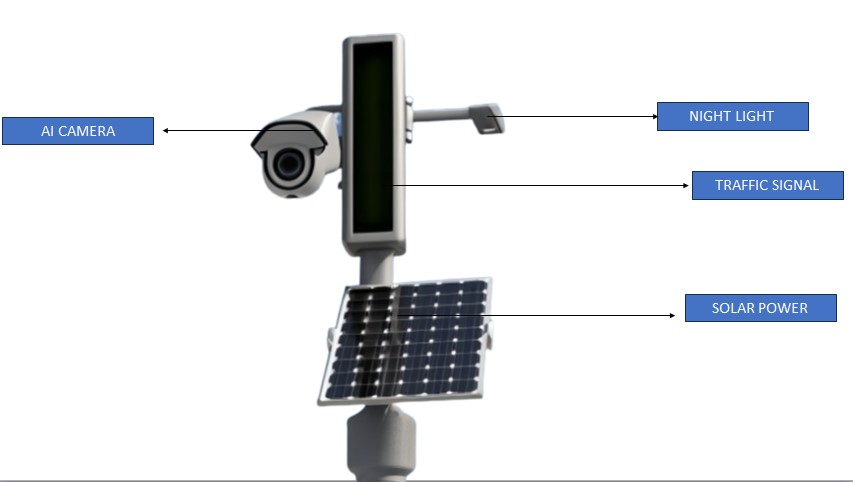
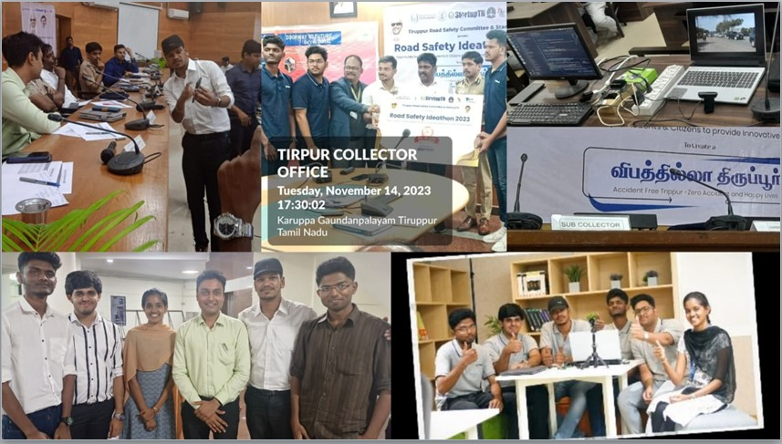

# 🧠 Neuro Vision – AI-Powered Traffic Monitoring System 🚦🚑

> ⚡ Revolutionizing Road Safety with AI | Built with NVIDIA Jetson Nano

---

## 🚨 Problem Statement

In India, over **40% of emergency deaths** are due to delayed ambulance arrival caused by traffic congestion. Meanwhile, daily traffic violations like riding without helmets and illegal lane changes go unnoticed, risking lives. There's a critical need for a real-time, automated, and intelligent traffic monitoring and emergency prioritization system.

---

## ✅ Our Solution

**Neuro Vision** is an AI-powered traffic management system that:
- Detects **helmet violations** using YOLOv9
- Classifies **vehicle types** using Haar cascades
- Detects and reads **number plates** with OCR
- **Tracks ambulances** in real time and **dynamically switches traffic signals** for their swift passage

All of this is integrated into a web dashboard that automates **fine collection**, event updates, and violation logs, reducing the burden on traffic police.

---

## 🧠 Tech Stack

| Component              | Technology           |
|------------------------|----------------------|
| Helmet Detection       | YOLOv5               |
| Vehicle Classification | Haar Cascade         |
| Number Plate OCR       | OpenCV + Tesseract   |
| Real-time Processing   | Python + OpenCV      |
| Edge AI                | NVIDIA Jetson Nano   |
| Backend Web Integration| Flask                |

---

## 🗂️ Folder Structure

📦 neuro-vision/

├── Helmet_detection/

│ └── Helmet_detection_live.py

├── License_plate_detection/

│ └── number_plate.py

├── vehicle_classification/

│ └── vehicle_detection.py

├── combined_models.py

├── requirements.txt

├── README.md

└── images/

├── helmet_violation_sample.jpg

├── number_plate_sample.jpg

└── vehicle_classification_sample.jpg

---

## 🧪 How to Run

1. **Clone the repository**
   
     git clone https://github.com/Sreejha-Jagadeesh/Neuro-Vision.git
   
     cd neuro-vision
   
2. **Install dependencies**
   
    pip install -r requirements.txt

3. **Run modules independently**

    Helmet Detection:

    python Helmet_detection/Helmet_detection_live.py

    License Plate Detection:

     python License_plate_detection/number_plate.py

    Vehicle Classification:

    python vehicle_classification/vehicle_detection.py

4. **Run all features together**
   
    python combined_models.py

📸Screenshots

### 🚨 Overall Workflow

### 🔍 Final Prototype

### 🚗 Achivements

🏆 Achievements
🥇 Winner - StartupTN Tiruppur Road Safety Ideathon

✅ Built a functional prototype with real-time traffic violation detection

⚙️ Integrated ambulance tracking with dynamic traffic signal switching

👮 Reduced manual effort for traffic enforcement through automation

🚀 What’s Next?
Expand ambulance GPS tracking integration, 
Create a full-stack web portal for public use and police monitoring,
Use AI to detect road accidents and send instant alerts, 
Integrate cloud-based storage and analytics .
